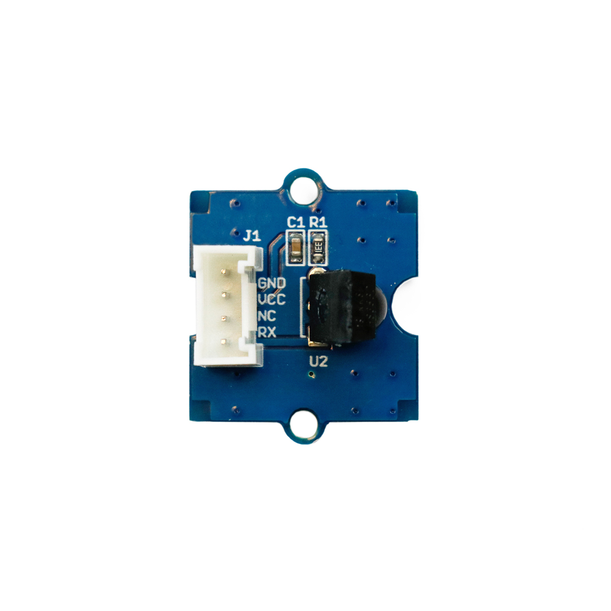

---
title: "Infrarot-Empfänger"
date: "2018-10-01T13:45:07.000Z"
tags: 
  - "sensor"
coverImage: "16_infrarot_empfaenger.jpg"
material_number: "16"
material_type: "sensor"
material_short_descr: "Seeed Studio Grove – Infrared Receiver"
manufacture: "Seeed Studio"
manufacture_url: "https://www.seeedstudio.com/"
repo_name: "mks-SeeedStudio-Grove_Infrared_Receiver"
product_url: "https://wiki.seeedstudio.com/Grove-Infrared_Receiver/"
clone_url: "https://github.com/Make-Your-School/mks-SeeedStudio-Grove_Infrared_Receiver.git"
repo_prefix: "mks"
repo_part: "Grove_Infrared_Receiver"
embedded_example_file: "examples/Grove_Infrared_Receiver_minimal/Grove_Infrared_Receiver_minimal.ino"
---

# Infrarot-Empfänger

## Beschreibung
Der Infrarot-Empfänger wird zu Empfangen von Signalen über infrarotes Licht eingesetzt. Als Partner kommt meist der Infrarot-Sender von Grove zum Einsatz, der die Signale generiert. Die maximale Reichweite beträgt ca. 10m. Der Empfänger kann direkt oder mithilfe des Grove Shields an einen Arduino oder Raspberry Pi angeschlossen werden. Er wird hierbei über einen digitalen Pin angesteuert.

Infrarot-Emitter und Infrarot-Empfänger können kombiniert als Signalübertragung genutzt werden oder auch als Lichtschranke verwendet werden. Der Infrarot-Emitter kann ebenfalls eingesetzt werden, um Fernbedienungen zu simulieren.

Alle weiteren Hintergrundinformationen sowie ein Beispielaufbau und alle notwendigen Programmbibliotheken sind auf dem offiziellen Wiki (bisher nur in englischer Sprache) von Seeed Studio zusammengefasst. Zusätzlich findet man über alle gängigen Suchmaschinen durch die Eingabe der genauen Komponentenbezeichnung entsprechende Projektbeispiele und Tutorials.

<!-- infolist -->

<!-- infolists -->
## Wichtige Links für die ersten Schritte:

- [Seeed Studio Wiki](http://wiki.seeedstudio.com/Grove-Infrared_Receiver/) [- IR Empfänger](http://wiki.seeedstudio.com/Grove-Infrared_Receiver/)
- [Sparkfun-Grundlagen IR Übertragung (englisch)](https://learn.sparkfun.com/tutorials/ir-communication/all)

## Projektbeispiele:

- [Hackster - Infrarot Übertragung](https://www.hackster.io/ctroberts/ir-launchpad-to-launchpad-communication-0dd109)
- [Nikolaus Lueneburg - IR Module](https://www.nikolaus-lueneburg.de/2014/10/arduino-infrarot-sende-und-empfangsmodul-teil-1/)

## Weiterführende Hintergrundinformationen:

- [GPIO - Wikipedia Artikel](https://de.wikipedia.org/wiki/Allzweckeingabe/-ausgabe)
- [GitHub-Repository: Infrarot-Emitter und -Empfänger](https://github.com/MakeYourSchool/15-16-Infrarot-Emitter-und-Empfaenger)

